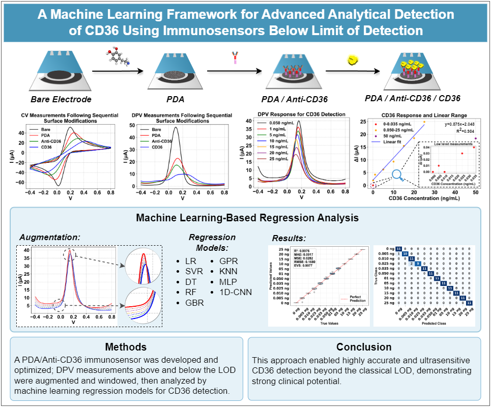

# A machine learning framework for advanced analytical detection of CD36 using immunosensors below limit of detection

We introduce a machine learning (ML)-based regression framework for quantitative electrochemical analysis, representing a paradigm shift from traditional univariate methods to a multivariate approach. Conventional analysis is constrained by reducing the entire signal to a single peak current feature to define a linear range and calculate a limit of detection (LOD). In contrast, our methodology treats the Differential Pulse Voltammetry (DPV) curve as time-series data, creating a high-dimensional fingerprint by systematically evaluating multiple data windows with varying widths around the main signal peak to identify the most informative segment. 



To validate this approach, a biosensor was developed by immobilizing Anti-CD36 antibodies on polydopamine-modified screen-printed carbon electrodes for the detection of CD36, a key protein in metabolism and immunity. Measurements were collected across 12 concentrations, including blank samples, spanning a range of 0 to 25 ng/mL.

* **Novel Analytical Approach:** First application of multivariate time-series analysis to DPV signals for sub-LOD quantification.
* **Ultra-Low Level Detection:** Achieves near-perfect prediction accuracy ($R^2$ > 0.99) across the entire 0 to 25 ng/mL range, operating without relying on traditional concepts like linear range or LOD.

### The framework consists of three main stages:

* **1. Data Preprocessing and Augmentation:** Raw DPV signals across 12 concentration levels (0 to 25 ng/mL) are extracted. Due to the limited number of samples, a pairwise convex combination interpolation technique is applied strictly to the training data. This mathematically synthesizes new signals between existing measurements to resolve the challenge of limited data at sub-LOD levels without causing data leakage.
* **2. Signal Windowing Strategy:** Instead of focusing on a single peak potential, the framework systematically evaluates multiple data windows (e.g., 60-160, 100-120) with varying widths around the main signal peak. This creates a high-dimensional fingerprint to identify the most informative segment and capture subtle discriminative features of the CD36-antibody interaction.
* **3. ML Regression and 1D-CNN:** Nine different regression models are evaluated, including traditional ML models (SVR, Random Forest, GBR, etc.) and a customized 1D-Convolutional Neural Network (1D-CNN) with Batch Normalization and MaxPooling. Continuous regression predictions are mapped back to discrete concentration categories to provide both regression ($R^2$, RMSE) and classification (Accuracy) metrics.

### Key Experimental Findings

* **Sub-LOD Prediction:** The top-performing models achieved near-perfect prediction accuracy ($R^2$ > 0.99) across the entire concentration spectrum.
* **Superiority of Time-Series Analysis:** The multivariate approach significantly outperformed traditional univariate peak-current analysis, demonstrating the method's ability to operate without relying on a linear range or traditional LOD.

### Clinical Implications

* Enables reliable detection at ultra-low levels for CD36, a key protein in metabolism and immunity.
* Provides a transferable approach for enhancing sensitivity in biomarker detection.
* Facilitates potential applications in clinical diagnostics and biomedical research.
* The immunosensor exhibited high selectivity against common interferents and excellent recovery in human serum.

---

## 📂 Project Architecture

```text
├── assets/                     # Schematic Figure
│   └── schematic.jpg
├── data/                       
│   ├── lab_measurements/       # Place raw Excel measurement folders here (e.g., '0 ng', '0.005 ng')
│   └── processed_datasets/     # Pre-processed .pkl files (generated by Script 1)
│
├── results/                    
│   ├── figures/                # Automated output for Confusion Matrices, Scatter and Box plots
│   └── tables/                 # Comprehensive Excel summary tables of model performances
│
├── 1_create_datasets.py        # Data Extraction & Pairwise Convex Combination Augmentation
├── 2_train_models.py           # Core Engine: ML & 1D-CNN Training across multiple Signal Windows
├── requirements.txt            # Python dependencies
├── .gitignore                  # Repository cleaning rules
└── README.md                   # Documentation
```

## 🚀 Getting Started

### 1. Installation
Clone the repository and install the required libraries:
```bash
pip install -r requirements.txt
```

### 2. Prepare the Dataset
Place your raw Excel folders (e.g., `0 ng`, `0.005 ng`, etc.) inside `data/lab_measurements/`. Then, run the data preparation script to apply the augmentation algorithm:
```bash
python 1_create_datasets.py
```
*This script extracts DPV currents, applies pairwise interpolation, and generates binary `.pkl` datasets.*

### 3. Run the Machine Learning Pipeline
Execute the main script to train 8 traditional ML models and a custom 1D-CNN architecture across 5 optimized signal windows:
```bash
python 2_train_models.py
```
*Results will be saved in high resolution (600 DPI) within the `results/` directory.*

## 🧠 Methodology Highlights

- **Windowing Strategy:** Instead of focusing on a single peak potential, the framework analyzes specific regions of the DPV curve to capture subtle discriminative features of the CD36-antibody interaction.
- **Convex Combination Augmentation:** To resolve the challenge of limited data at sub-LOD levels, a mathematical pairwise interpolation technique is used to synthesize training data without causing data leakage.
- **Ordinal Mapping:** Continuous regression predictions are mapped back to discrete concentration categories to provide a holistic view of both classification accuracy and regression error (R², RMSE).
- **Deep Learning Integration:** Utilizes a customized **1D-Convolutional Neural Network (1D-CNN)** with Batch Normalization and MaxPooling for superior feature extraction from raw signal trends.

## 📊 Evaluation Metrics
The models are automatically ranked and compared based on:
- **Goodness of Fit:** R-squared (R²)
- **Error Magnitude:** RMSE and MAE
- **Classification Performance:** Accuracy, Precision, Recall, and F1-Score (via ordinal mapping)

## 📑 Citation
If you utilize this framework or the associated methodology in your research, please cite:
```latex
@article{YEKE2026100733,
title = {A machine learning framework for advanced analytical detection of CD36 using immunosensors below limit of detection},
journal = {Biosensors and Bioelectronics: X},
volume = {28},
pages = {100733},
year = {2026},
issn = {2590-1370},
doi = {https://doi.org/10.1016/j.biosx.2025.100733},
url = {https://www.sciencedirect.com/science/article/pii/S2590137025001608},
author = {Muhammet Cagri Yeke and Sultan Sacide Gelen and Hilal Fil and Muhammet Mustafa Yalcin and Abdurrahman Gumus and Idris Yazgan and Dilek Odaci},
keywords = {CD36, Biosensor, Regression, Machine learning, Augmentation},
abstract = {We introduce a machine learning (ML)-based regression framework for quantitative electrochemical analysis, representing a paradigm shift from traditional univariate methods to a multivariate approach. Conventional analysis is constrained by reducing the entire signal to a single peak current feature to define a linear range and calculate a limit of detection (LOD). In contrast, our methodology treats the Differential Pulse Voltammetry (DPV) curve as time-series data, creating a high-dimensional fingerprint by systematically evaluating multiple data windows with varying widths around the main signal peak to identify the most informative segment. To validate this approach, a biosensor was developed by immobilizing Anti-CD36 antibodies on polydopamine-modified screen-printed carbon electrodes for the detection of CD36, a key protein in metabolism and immunity. Measurements were collected across 12 concentrations, including blank samples, spanning a range of 0 to 25 ng/mL. Following data augmentation, nine different regression models were evaluated, with the top-performing models achieving near-perfect prediction accuracy (R2>0.99) across this entire range. This high accuracy across the full concentration spectrum quantitatively demonstrates the method’s ability to operate without relying on traditional concepts like linear range or LOD, enabling reliable detection at ultra-low levels. Furthermore, the immunosensor exhibited high selectivity against common interferents and excellent recovery in human serum. This methodology represents a significant advancement in analytical electrochemistry, providing a transferable approach for enhancing sensitivity in biomarker detection with potential applications in clinical diagnostics and biomedical research. The codes and dataset are made publicly available on GitHub to support further research: https://github.com/miralab-ai/biosensors-AI.}
}
```

## 📜 License
This project is licensed under the **MIT License** - see the LICENSE file for details.